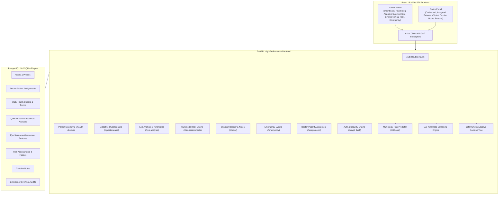

# VertiCare AI — Clinical Decision Support & Vertigo Monitoring System

> **ACADEMIC HEALTHCARE PROTOTYPE NOTICE:**  
> VertiCare AI is an academic healthcare software prototype engineered for vertigo screening, continuous daily monitoring, and clinician decision support. **It is NOT a clinically validated medical device** and does not diagnose conditions, prescribe medications, or replace the clinical evaluation of an ENT specialist, neurologist, or other qualified healthcare provider.

---

## 1. System Architecture



---

## 2. Implemented Modules (15 Core Modules)

1. **Authentication & Identity:** Role-based authentication (PATIENT / DOCTOR) with bcrypt password hashing and secure HS256 JWT tokens.
2. **Patient Account & Profiles:** Patient demographic data, medical histories, emergency contacts, and active doctor linkage.
3. **Doctor Account & Profiles:** Specialization, medical license registration, assigned cohort management.
4. **Patient / Doctor Authorization:** Server-side anti-IDOR checks enforcing strict patient tenant isolation and verified doctor-patient assignments.
5. **Daily Health Monitoring:** Severity tracking (dizziness, imbalance, nausea, tinnitus, headache), trigger logs, and longitudinal trend analytics.
6. **Adaptive Questionnaire:** Deterministic branching clinical tree (10 clinical questions) mapping vertigo onset, triggers, and duration.
7. **Computer Vision Eye-Movement Screening:** Real-time MediaPipe facial mesh landmark tracking, extracting 10 kinematic features (amplitudes, velocities, directional reversals, blink rates).
8. **ML Risk Engine:** Offline-trained XGBoost / Gradient Boosting multimodal risk prediction engine with graceful fallback imputation.
9. **Risk Assessment:** Calibrated risk tiers (LOW, MEDIUM, HIGH) with contributing factor breakdown and non-diagnostic disclaimers.
10. **Patient Longitudinal History:** Consolidated timeline across symptom checks, screening questionnaires, eye tests, and clinical notes.
11. **Doctor Dashboard:** Live clinician KPI overview, risk distribution breakdown, and real-time patient activity feed.
12. **Doctor Patient Monitoring Dossier:** Comprehensive sub-navigation view of assigned patient health history, eye kinematics, and questionnaires.
13. **Doctor Clinical Notes:** Clinician observation logging with privacy sharing controls and audit timestamps.
14. **Clinical Summary Reports:** Comprehensive multi-modal summary reports for patient records with clinical disclaimers.
15. **Emergency Support & Red-Flag Escalation:** Red-flag triage for acute symptoms, emergency contact integration, and clinician alert resolution workflows.

---

## 3. Technology Stack

- **Backend:** Python 3.13, FastAPI, SQLAlchemy 2.0, Pydantic v2, Alembic, Uvicorn, HTTPX.
- **Machine Learning & CV:** XGBoost, Scikit-Learn, Joblib, MediaPipe, OpenCV.
- **Frontend:** React 18, TypeScript, Vite, Tailwind CSS, TanStack Query v5, React Router v6, Lucide React, Recharts.
- **Database & Deployment:** PostgreSQL 16 Alpine / SQLite fallback, Docker & Docker Compose, Nginx.

---

## 4. Local Quickstart

### Prerequisites
- Python 3.11+
- Node.js 18+ (Node 20+ recommended)
- Docker & Docker Compose (optional for PostgreSQL)

### Running Backend
```bash
cd backend
python3 -m venv .venv
source .venv/bin/activate
pip install -r requirements.txt
uvicorn app.main:app --host 127.0.0.1 --port 8000 --reload
```

### Running Frontend
```bash
cd frontend
npm install
npm run dev
```

### Running Tests
```bash
# Full test suite across backend, CV, and ML
MPLCONFIGDIR=/tmp PYTHONPATH=.:backend:cv:ml backend/.venv/bin/pytest backend/tests/ cv/tests/ ml/tests/ -v

# Frontend TypeScript check and production build
cd frontend
npm run build
```

---

## 5. Deployment Architectures

### A. Cloud Deployment (Vercel + Render)
- **Frontend (Vercel):** Serves the React 18 / Vite SPA with automated SPA routing and `/api/*` reverse-proxying.
- **Backend & Database (Render):** Deploys FastAPI web service and managed PostgreSQL database via `render.yaml`.
- **Single Public URL:** Users access `https://<vercel-domain>`, and API requests to `/api/v1` are securely proxied behind the scenes to Render.

See full instructions in [Deployment Guide](docs/deployment/deployment.md).

### B. Local Container Deployment (Docker Compose)
```bash
docker compose up -d --build
```
This builds and starts PostgreSQL (port 5432), FastAPI Backend (port 8000), and Nginx Frontend (port 80).
