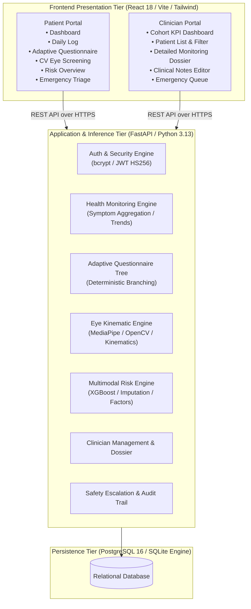

# VertiCare AI — Global Architecture Overview

## 1. System Topology

VertiCare AI is organized as a decoupled three-tier architecture with strict boundaries between presentation, business logic/inference, and persistence layers.

## 2. Core Architectural Guarantees
1. **Zero Database Access from Frontend:** The client communicates exclusively through RESTful JSON APIs.
2. **Server-Side Authorization & Anti-IDOR:** Relational access checks (`require_patient`, `require_doctor`, `require_doctor_patient_access`) enforce data isolation on every API route.
3. **Graceful Multimodal Inference:** The ML Risk Engine can execute predictions with complete data (health check + questionnaire + eye features) or partial data using validated clinical medians/fallback imputation.
4. **Non-Diagnostic Safety Design:** All patient-facing and clinician-facing screens include non-diagnostic disclaimers and explicit emergency escalation guidance.

